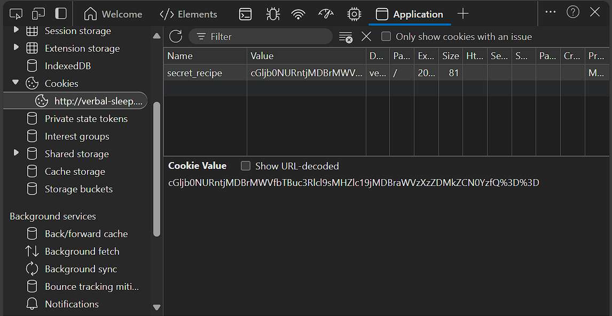

# 🍪 Cookie Monster - Web Exploitation (picoCTF)

## 📝 Deskripsi Soal

> Cookie Monster has hidden his top-secret cookie recipe somewhere on his website.  
> As an aspiring cookie detective, your mission is to uncover this delectable secret.  
> Can you outsmart Cookie Monster and find the hidden recipe?  
> You can access the Cookie Monster [here](#) and good luck!

---

## 🧠 Studi Kasus: Cookie dan Keamanan

Cookies adalah file kecil yang disimpan oleh website di browser pengguna. Cookies umum digunakan untuk:

- Menyimpan data sesi (contoh: status login)
- Melacak aktivitas pengguna (tracking)
- Menyimpan data dalam bentuk terenkripsi atau encoded

---

## 🧪 Teknik yang Digunakan

Pada challenge ini, kita membuka DevTools (Inspect → Application → Cookies) dan menemukan sebuah cookie dengan nilai tertentu.

Langkah selanjutnya:

1. Salin nilai cookie tersebut.
2. Coba decode menggunakan Base64 decoder seperti: [base64decode.org](https://www.base64decode.org/)
3. Jika berhasil, kamu bisa mendapatkan data berupa string teks, kadang berisi informasi rahasia.

📌 Dalam challenge ini, hasil decode menunjukkan informasi rahasia berupa resep rahasia dari Cookie Monster!

---

## 🧩 Perbedaan Encoding vs Enkripsi

| Fitur               | Encoding                           | Enkripsi                        |
|---------------------|------------------------------------|----------------------------------|
| Tujuan              | Format & kompatibilitas            | Menjaga kerahasiaan             |
| Bisa dibaca semua?  | ✅ Ya                               | ❌ Tidak (perlu kunci)           |
| Bisa dibalik?       | ✅ Ya (tanpa kunci)                 | ✅ Ya (dengan kunci)             |
| Contoh              | Base64, URL Encoding, UTF-8        | AES, RSA, ChaCha20              |

### ✅ Encoding
- Data diubah ke format yang bisa dikirim atau disimpan dengan aman.
- Tidak bersifat rahasia.
- Contoh:  
  `Hello` → `SGVsbG8=` (Base64)  

### 🔐 Enkripsi
- Data dienkripsi agar tidak bisa dibaca oleh pihak ketiga.
- Hanya bisa dibalik (dekripsi) jika memiliki kunci tertentu.

---

## 🍪 Jenis Cookie Berdasarkan Keamanan

1. 🧾 Cookie yang diencode  
   Data dikonversi ke format seperti Base64 agar bisa disimpan/ditransmisikan, tapi tidak terenkripsi.

2. 🔒 Cookie yang dienkripsi  
   Data dalam cookie dilindungi dengan algoritma enkripsi (AES, RSA).

3. 🆔 Session ID Cookie  
   Cookie menyimpan ID acak (misal: session=abc123), sementara data sesungguhnya disimpan aman di server.

---

## ⚠️ Catatan Keamanan

- Hindari menyimpan data sensitif di cookie kecuali terenkripsi.

---
